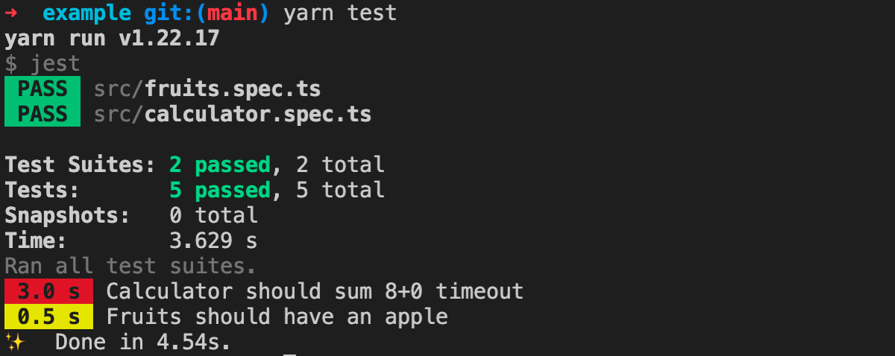

# Overview

🧐 Identify slow tests during development

📚 Create json report including the test execution times

```bash
yarn add -DE @jest-performance-reporter/core
```



# Setup

Configure jest to use this reporter via the jest section in the package.json or your jest config.

```json
{
  "reporters": [
    "default",
    [
      "@jest-performance-reporter/core",
      {
        "errorAfterMs": 1000,
        "warnAfterMs": 500,
        "logLevel": "warn",
        "maxItems": 5,
        "jsonReportPath": "performance-report.json"
      }
    ]
  ]
}
```

The "default"-reporter creates the default jest output. If you don't need it, of course you can remove it.
